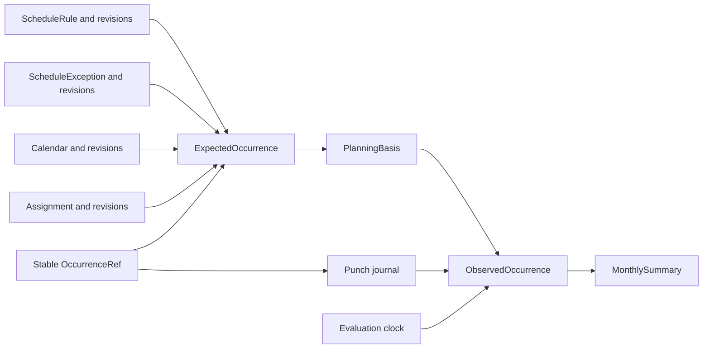

# Domain model

Status: frozen conceptual baseline for V1 under the product owner's delegated decision mandate. Names, responsibilities, relationships and invariants below are adopted. This is not a SQL schema, API contract or implemented system. Evidence and remaining verification limits are recorded in the [prototype report](13-prototype-verification.md).

## Decided

The planned side is computed from **ScheduleRule + Calendar + ScheduleException**. Expected occurrences are computed on demand, with no pre-filled occurrence table and no periodic generation job.

The observed side is described by **append-only Punches**: check-ins are added to the history, with no silent rewriting. A correction adds a fact that logically supersedes a previous one. The observed state is derived from the log.

A school lunch with no check-in becomes **presumed taken** at the end of its planned slot, unless explicitly declared otherwise. Before then it remains planned and is excluded from the taken-meal total. Presumed attendance is distinct from explicitly declared attendance. An end-only after-school-care check-in uses the planned start to calculate duration, with that start explicitly marked **estimated**. Neither inference is a declared Punch. The resulting duration retains its estimated-start provenance. See the [confirmed rules](01-v1-scope.md#confirmed-plannedobserved-rules) and the [domain glossary](../CONTEXT.md).

An explicitly declared lunch absence replaces a presumed meal. A subsequently declared arrival replaces the estimated start in the calculation, preserving history. Conflicting explicit declarations follow the adopted [V1 business decisions](12-v1-business-decisions.md#concurrent-declarations-and-corrections).

For an explicitly declared care event, missing required times or inconsistent timing produce a **Needs completion** result. Its duration is excluded from the calculated total, which is identified as incomplete. A valid estimated start remains usable under the confirmed end-only rule; lack of an actual arrival declaration alone does not make that duration incomplete. For morning care, a usable pattern-derived end similarly removes the need for a separate exit declaration.

A mistaken Punch may be annulled while its history remains available. The append-only history must retain that annulment rather than silently removing the original declaration. After annulment, the state is recalculated from the remaining information. For afternoon care with a remaining exit declaration, annulling a separately declared arrival restores the pattern-derived start. Annulling the only morning entry or afternoon exit restores the normal school arrival or pick-up assumption. Annulment of a lunch absence restores a presumed meal after the planned slot ends if the planned lunch still applies and no other declaration overrides it; before then it restores the planned state. Annulment is an append-only action in the Punch journal, targeting an earlier declaration or correction as defined below.

Two declarations of the same type for the same child and session are a **Suspected duplicate**. They are flagged without automatically selecting a declaration to retain. Resolution explicitly selects the correct declaration and annuls the other while retaining history. Until resolution, the affected duration is excluded from the total and the summary is marked incomplete. This does not conflate a repeated transmission of one operation with two independent declarations.

The monthly summary distinguishes declared and presumed meals, and fully declared and estimated durations, with a count of sessions that need completion. The duration of an unresolved suspected duplicate is excluded, with an incomplete-summary indicator.

A change to the weekly template takes effect from a chosen date. Sessions before that effective date and their calculations retain the planning information that applied to them. Correcting the past is a separate, explicit and traceable action. This principle was confirmed in [Occurrence identity and preservation of the past when rules or calendars change](https://github.com/leokun/foylo/issues/8); immutable revisions with effective dates are now selected in the [V1 business decisions](12-v1-business-decisions.md#planning-versions-and-preservation-of-history).

School-calendar updates also preserve past sessions and their calculations. Applying a retroactive calendar correction must be explicit and traceable.

Occurrence identity distinguishes separate slots on the same day, even for the same activity. A one-off activity has its own occurrence identity. A time change within the same day preserves the session identity and its attached Punches and ScheduleExceptions. Preserving attachment does not override the protection of historical calculations or silently change declared times. The conceptual identity uses a stable slot/person/original-date reference for recurring sessions and an independent identity for one-off activities; its storage encoding remains implementation work. Cross-day identity preservation is confirmed for one-off activities without recorded Punches and after explicit annulment of a mistaken attendance declaration. Actual attendance stays attached to the original appointment; another appointment is a new occurrence. Recurring moves and remaining declaration cases follow the [V1 business decisions](12-v1-business-decisions.md#occurrence-identity-and-moves).

A school/care pattern defines school dismissal and a possible care start. With school ending at 16:30 and care starting at 16:45, no action means normal school pick-up is assumed, not automatic care attendance. Selecting **Care exit** at 17:00 automatically records a 16:45-17:00 interval, distinguishing the pattern-derived start from the declared end. A scheduled slot without an exit is not an incomplete care record. The declared exit is a Punch; the pattern-derived start is a boundary of the computed reading with its PlanningBasis, never a synthetic Punch. A generic child-pick-up event is not required by this interaction.

Morning care uses the complementary interaction: a declared Care entry at 07:45 and an 08:30 school start in the pattern automatically record both interval boundaries and 45 minutes of care. The start is declared and the end is pattern-derived. No entry declaration means normal school arrival is assumed, without recorded care or an incomplete-care warning. The morning pattern-derived end, like the afternoon pattern-derived start, must remain distinct from an independently declared fact.

For a valid morning entry, the interval remains in progress until its pattern-derived end. Its full duration is shown as expected during that interval and enters the calculated total only when that end is reached. For entry at 07:45 and school at 08:30, the display at 08:00 shows Care in progress and 45 expected minutes; at 08:30, the total includes 45 minutes with a pattern-derived end. This transition creates no declared exit.

An optional explicit morning Care exit replaces the pattern-derived end while preserving history. With entry declared at 07:45, an exit declared at 08:10 gives 25 minutes based on two declared boundaries instead of the 45 minutes expected until 08:30. The interval is then completed and contributes 25 declared minutes to the calculated total.

Existing future ScheduleExceptions are preserved when the weekly template changes. If the new plan makes an exception incompatible, it is flagged for review rather than automatically deleted. For example, an exceptional 17:30 pick-up planned for next Thursday survives a template change effective Monday. When the new template removes the slot targeted by an existing exception, the affected session remains visible as To resolve. The parent explicitly chooses either to keep that session as a one-off activity or to cancel it, preserving history. No automatic deletion or silent choice is made. Calendar precedence and other incompatibilities follow the [V1 business decisions](12-v1-business-decisions.md#calendars-and-exceptions).

Moving a one-off activity to another day before any Punch has been recorded preserves the same occurrence identity, its information and the responsible adult. The date change remains traceable. For example, an appointment moved from Wednesday to Thursday remains the same appointment. If declared attendance reflects an appointment that actually took place on Wednesday, that appointment remains in history and a Thursday appointment is a new occurrence. If the Wednesday attendance declaration was a mistake, it must be explicitly annulled before moving the same appointment, preserving both the declaration and its annulment in history. The move does not change the date of the original declaration. Moves of recurring sessions and other cases involving existing declarations follow the [V1 business decisions](12-v1-business-decisions.md#occurrence-identity-and-moves).

## Frozen concepts and responsibilities

An entity below denotes a domain responsibility, not a commitment to one database table per row. Value objects and projections are explicitly identified.

| Concept | Kind | Responsibility and relationships |
| --- | --- | --- |
| Family | Entity | Household boundary; owns people, places, activities, calendars and planning. Holds the reference time-zone history. |
| User | Entity | Authenticated account, independent of a represented Person and of any provider identifier. |
| FamilyMembership | Entity | Links exactly one User to one Family, with access status and role. V1 permits at most one active Family per User and at most two active adult memberships per Family. |
| Person | Entity | A represented child or adult belonging to exactly one Family. May link to one User; a User represents at most one Person within a Family. That optional link alone grants no access. |
| Place | Entity | A named location owned by the Family, with optional address. An activity/session may have no Place. Coordinates are not required by this model. |
| Activity | Entity | Family-owned activity definition: school, lunch, care, daycare, nanny or another activity. Defines its interpretation mode: attendance quantity, explicit interval, morning care or afternoon care. |
| Calendar | Entity with revisions | Family-scoped opening/closure policy for an activity/place context, with general holiday inputs, explicit institution exceptions, coverage and source provenance. |
| ScheduleRule | Entity with revisions | One stable recurring slot for one Person and one Activity. Revisions provide weekdays, effective dates, local boundaries, optional Place and applicable Calendar. Two daily slots use two distinct rules. |
| ScheduleException | Entity with revisions | A dated addition, cancellation, move or override on the planned side. Targets one OccurrenceRef; a one-off addition establishes a new reference. It does not declare attendance. |
| Assignment | Entity with revisions | Names one responsible adult Person for one responsibility, such as drop-off or pick-up. Applies either to a recurring rule or to one OccurrenceRef as a dated override. |
| PlanningRevision | Immutable record | Revision of one planning subject, including its applicable local dates, predecessor, author/source and recording time. A proposal conflicting with an accepted revision is retained without silently becoming effective. |
| OccurrenceRef | Value object | Stable reference to one person's session. Recurring origin: Family, ScheduleRule, Person and original local date. One-off origin: Family, addition identity and Person. Current date/time and revision identifiers are not identity components. |
| PlanningBasis | Value object | References the accepted revisions used for a computed session or inferred boundary, including rule/addition, exceptions, calendar and household time zone. Includes dependency references when a school boundary supplies a care boundary. |
| Punch | Immutable journal record | A declaration or an action on declarations: correction, annulment or explicit conflict resolution. Targets one OccurrenceRef and records its author and time provenance. |
| ExpectedOccurrence | Projection | On-demand reading of an OccurrenceRef from accepted planning revisions, exceptions and calendars. Exposes planned boundaries, place, assignments, PlanningBasis and any planning conflict. |
| ObservedOccurrence | Projection | Reading of the Punch journal for that OccurrenceRef together with any required PlanningBasis and the evaluation clock. Exposes active facts, inferred boundaries, conflicts and quantity/duration provenance. |
| MonthlySummary | Projection | Aggregates readings by Family, Person, Activity and household-local month, keeping declared/presumed meals and declared/estimated durations separate. |

The diagram shows dependencies, not a requirement to materialize every projection. When a declaration uses an older planning basis, the observed reading retains that basis rather than substituting the newest ExpectedOccurrence.

## Household and relationship invariants

- All business references stay within one Family: Person, Activity, Place, Calendar, rule, exception, assignment and Punch. A global User cannot use a reference from another Family merely because it is known.
- A Person can exist without an account, receive an account later and retain the same planning and attendance history. A grandparent can be responsible for collection without membership or application access.
- Membership is the access authority. A Punch author is the authenticated User acting through a FamilyMembership, distinct from the child/adult Person whose attendance is declared. Revocation does not rewrite authorship in historical records.
- A Family can start with one adult and add the second. The access policy will define owner transfer, invitations and deletion; these operations use FamilyMembership rather than changing Person identity. V1 does not introduce external-caregiver grants.
- A ScheduleRule belongs to one Person and Activity for its lifetime. Changing the subject person or activity creates a new rule. Time, place, responsibility and prospective calendar changes use revisions or dated overrides.
- An Assignment targets either a rule or an occurrence, never both. There is at most one accepted responsible adult for each target/responsibility at a given effective date. A dated assignment overrides the recurring assignment for that responsibility only. Missing responsibility is visible as unassigned; it is not silently attributed to the person who later enters a Punch.
- A dated move keeps occurrence assignments attached. Another occurrence's assignments do not merge into it when the dates overlap.

## Recurrence, one-off activities and stable references

Recurring identity uses the original planned date, even after a move. For example, the Wednesday session keeps its Wednesday origin reference when displayed on Thursday. An independently scheduled Thursday session remains a different occurrence.

A one-off addition is a ScheduleException with its own stable addition identity and planning content. Later revisions can move or cancel it without replacing its OccurrenceRef. An override on an existing session targets its reference instead of creating another occurrence.

Keeping a removed recurring slot as a one-off session preserves the existing recurring-origin reference. A dated retention exception supplies the standalone planning content and detaches that session from future recurrence changes. The original rule remains available for historical interpretation; the retained session is not assigned a fresh one-off-origin identity.

ExpectedOccurrences are computed on demand. The view also includes references found in dated exceptions and declarations, so a removed recurring rule cannot hide a retained session or its history. There is no requirement to pre-create occurrence rows for future months. A future storage design must support references without pretending a pre-generated occurrence table is the source of truth.

Calendar closure or personal cancellation affects the planned reading, not the continued existence of an OccurrenceRef already referenced by history. Declarations remain readable when the plan is cancelled, moved or contradicted.

## Revisions, planning basis and provenance

Each accepted PlanningRevision preserves its original content and predecessor. Effective local dates determine where it applies; recording time says when it was entered. Changing a plan from next Monday does not modify last Thursday's basis. Closing a validity interval is derived from successor revisions, rather than rewriting the earlier revision's content.

The same principle applies to rules, exceptions, calendar inputs, assignments and household time-zone changes. A multi-subject planning change, such as coordinated school and care times, is one traceable accepted change set: readers must not combine half of its changes with half of the previous basis. Storage and transaction boundaries are implementation details.

Each rule or one-off addition selects an applicable Calendar; an explicitly always-open local policy is a Calendar too. Its general holiday inputs and institution information are composed within that policy, rather than leaving readers to guess which competing calendar applies. Calendar revisions retain the coverage interval, source identity and retrieval information in addition to openings/closures. No record for a year outside known coverage means unknown, not open. Activity-level calendar policy determines which general school/public holidays apply. The precedence rules remain those in [V1 business decisions](12-v1-business-decisions.md#calendars-and-exceptions).

A care rule's inferred boundary is either a local value in the applicable revision or an explicit dependency on a school slot boundary. A dependency identifies the relevant school session and its revision, stays within the same Family and Person, and cannot form a cycle; never infer it by finding the nearest school time. Missing or ambiguous dependencies produce unresolved planning or Needs completion when they prevent a declared duration from being calculated.

PlanningBasis is retained with a declaration whenever it uses a derived boundary, and identifies the exact revisions used. A computed presumed meal with no Punch is reconstructible from the retained calendar/rule/exception revisions; its existence does not require a synthetic attendance event. The current evaluation clock is an input to the reading, not a new historical fact.

If an offline declaration's basis is incompatible with newly received planning, expose the disagreement and preserve the original calculation basis. An explicit historical correction identifies the affected references/dates, its reason, its previous basis and the selected replacement. This produces a new reading while retaining the old evidence. Editing a rule is not implicit authorization to reinterpret historical Punches.

Archiving a reference entity hides it from new selection but does not break historical references. Rename/edit history must retain enough original context to explain past sessions. Legal/account deletion and retention are governed by the later privacy requirements; append-only business history is not a promise to retain personal data forever.

## Punch journal and resolution semantics

All journal records have a stable operation identity, Family, OccurrenceRef, author, device identity and device-recorded time. Server acceptance/receipt is recorded separately from the client-authored record. Retry identity is distinct from the semantic question of whether two parents declared the same event.

| Journal action | Required domain content | Interpretation |
| --- | --- | --- |
| Declaration | START, END, PRESENT or ABSENT; event time or attendance date appropriate to its kind; PlanningBasis where inference is required | Adds a declared fact. A morning entry is START; an afternoon exit is END. |
| Correction | Target declaration/correction, known resolution context, replacement value and event-time provenance | Supersedes that fact in the current reading while preserving the earlier value. |
| Annulment | Target declaration/correction, known resolution context and author/time provenance | Withdraws that fact from the active reading without declaring absence or deleting history. |
| Resolution | Complete set of competing journal references, selected outcome and recorded annulment of discarded alternatives | Resolves that known conflict atomically. All retained and discarded facts remain auditable. |

Correction and annulment references are within the same Family and OccurrenceRef, acyclic, and cannot invent a target. A missing target during synchronization is pending dependency information, not permission to treat a correction as a new root declaration. A correction changes an attendance value; it does not move the original fact to another child or session. Correcting a wrong-session entry requires explicit annulment and a new declaration on the right session.

A resolution records both the retained choice and withdrawal of losing alternatives. Its physical encoding as one record or an atomic group is deliberately not a SQL/API decision here. It names the conflict set it resolves, so a later independent contradictory fact cannot be silently absorbed. Competing resolutions or concurrent corrections remain unresolved until another explicit resolution covers them. A sequential correction targets the retained fact and the resolution context it was based on, distinguishing it from a concurrent mutation made without that context.

Annulment is not undone by deleting it. If an annulment was itself mistaken, a new declaration records the intended fact with a reference to the prior history. Whether two actions form a single quick user interaction is an acceptance/UI decision, not a different journal model.

For a care declaration with a derived opposite boundary, store the declaration and its PlanningBasis. Do not append a synthetic START or END. The ObservedOccurrence exposes the full interval and the provenance of each boundary. A later real declaration replaces the inferred boundary in the reading; annulling it restores the applicable inference.

## Projection states and totals

Planning, observation and delivery status are separate axes. A locally recorded valid Punch can already affect the local reading while still awaiting server acceptance; rejected data remains explainable but cannot be presented as shared accepted data.

| Axis | Reading | Effect |
| --- | --- | --- |
| Planning | Planned, cancelled, unknown coverage, To resolve | Determines expected participation and whether automatic inference is permitted. |
| Observation | Normal-school assumption, planned only, care in progress, declared/presumed meal, declared absence, completed duration, Needs completion, conflict | Describes evidence and what can currently be counted. |
| Delivery | Local pending, accepted, rejected, pending dependency | Describes synchronization/validation progress, independently of attendance. Receipt on another phone is a separate observation. |

A valid in-progress interval shows expected duration and contributes no completed duration. An ambiguous or missing required boundary is Needs completion. A conflict excludes its affected quantity/duration. An unverified calendar blocks presumption but does not erase an explicit attendance declaration. These conditions retain their reasons rather than becoming indistinguishable zero values.

MonthlySummary groups by the effective session start date in the household zone. When start time is unavailable, retain the session's effective planned date for identifying the excluded item; flag an unknown month instead of dropping the item if neither is known. Cross-midnight duration belongs to the start-date month. The immutable origin date is for identity, not monthly grouping after a permitted move.

A summary contains declared and presumed meal counts, declared and estimated completed durations, and distinct counts/reasons for Needs completion, conflicts, unresolved planning and pending/rejected delivery. Count affected sessions once per category, and expose overlaps when presenting a combined warning count. A complete business calculation does not imply that all facts have synchronized.

## Conceptual walkthrough review

This is a documentation consistency review, not additional executed tests. The [20 prototype scenarios](13-prototype-verification.md) remain the separate execution evidence.

| V1 journey or edge | Concepts and invariant that support it |
| --- | --- |
| Two children with different places/templates | Separate Persons and ScheduleRules, optional Places and activity-specific Calendars |
| Exclude school closures | Calendar revisions and precedence inform ExpectedOccurrence; explicit Punches survive disagreement |
| Change responsible adult for one Thursday | Occurrence-scoped Assignment overrides only that responsibility/date |
| Record offline and receive on second phone | Stable Punch operation identity, separate delivery state, retained PlanningBasis; transport remains to be selected and verified |
| Correct 17:48 to 17:43 | Correction targets the earlier Punch; ObservedOccurrence changes while history remains |
| Monthly comparison with missing data | ExpectedOccurrence and ObservedOccurrence remain distinct; MonthlySummary exposes provenance and exclusions |
| Morning entry, inferred school-start end, exceptional exit | One START plus PlanningBasis; real END replaces inference without changing identity |
| Move Wednesday to Thursday | Stable OccurrenceRef, revised date and retained Assignment; month grouping follows the effective date |
| Remove a rule with a future exception | Dated retention/cancellation targets the original reference; history does not depend on continued recurrence |
| Conflicting corrections or resolutions | Journal conflict sets, causal context and atomic explicit resolution; no clock-based winner |
| Link an account to an existing represented adult | Person identity and history stay unchanged; FamilyMembership separately grants access |

## Remaining work and boundaries

The conceptual baseline is frozen for V1. SQL tables/columns, indexes, identifier encoding, API payloads, transaction design, synchronization engine and repository tooling remain implementation or technical-foundation work. Access policy, invitations, privacy/retention, notifications and full acceptance criteria remain their own specification tasks. No backend/provider capability or browser acceptance is asserted by this freeze.

## Rejected/deferred

- Mutable occurrence as the single source of the observed side: replaced by the journal and projections.
- Materializing several months of expected occurrences: replaced by on-demand computation and stable references.
- Activity/date or current-start-time identities: cannot distinguish daily slots or survive moves.
- Full RRULE: weekly recurrence with effective revisions is sufficient for V1.
- PickupRun/PickupStop and cross-household grants: outside V1.
